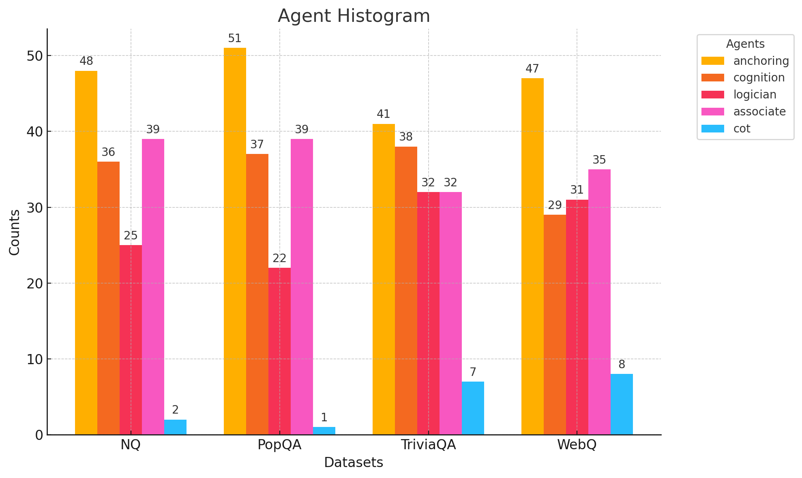

# AURA - ActiveRAG Unified Agent Model

# Table of Contents
1. [Overview](#overview)
2. [Prerequisites](#prerequisites)
3. [Setup Guide](#setup-guide)
   - [Installation](#installation)
   - [Reproduction](#reproduction)
4. [File Description](#file-description)
5. [Experiments](#experiments)
   - [Baseline Models](#baseline-models)
   - [Small Models](#small-models)
   - [Big Models](#big-models)
6. [Results](#results)
   - [Table 1-Accuracy Comparison of ACTIVERAG Agents and AURA Models](#table-1-accuracy-comparison-of-activerag-agents-and-aura-models)
   - [Table 2-BLEU Comparison of ACTIVERAG Agents and AURA Models](#table-2-bleu-comparison-of-activerag-agents-and-aura-models)
   - [Table 3-Accuracy Comparison of AURA Models and Baseline Models](#table-3-accuracy-comparison-of-aura-models-and-baseline-models)
   - [Figure 1-Agent Selection Frequency Across Datasets](#figure-1-agent-selection-frequency-across-datasets)
7. [Contact](#contact)


## Overview

This project extends the ACTIVERAG framework to improve Large Language Model (LLM) performance on knowledge-intensive question-answering tasks by addressing limitations in traditional Retrieval-Augmented Generation (RAG) systems. Conventional RAG models retrieve information passively, often leading to hallucinations, incomplete answers, and poor contextual integration. ACTIVERAG introduced a multi-agent approach with agents like Anchoring, Logician, Cognition, and Associate, each contributing unique reasoning and retrieval capabilities. However, previous implementations generated separate outputs from each agent, resulting in fragmented responses.

AURA (ActiveRAG Unified Agent Model) consolidates multiple agents into a unified output by embedding each agent’s response with BERT or RoBERTa and dynamically assigning weights through a neural network. This setup selects the most contextually relevant response by locating the agent output closest to a central embedding point. AURA’s dynamic agent weighting system adapts to the specific needs of each query, resulting in more accurate and contextually aligned answers.

## Prerequisites
You will need the following dependencies installed on your machine:

Python 3.8 or higher

## Setup Guide
### Installation
To reproduce the results of this project, you can clone the repository and install the required dependencies:

```bash
git clone https://github.com/yael-katsman/ActiveRAG
pip install -r requirements.txt
```
### Reproduction
To run the small model:

```bash
python -m Models.small_model --dataset nq --topk 5
```
To run the big model:

```bash
python -m Models.big_model --dataset nq --topk 5
```

To run the model on a different dataset, replace `nq` with any dataset from the following list: `[nq, triviaqa, popqa, webq]`. 

The `topk` parameter can be set to either `5` or `10`, depending on the ActiveRAG setting you want to explore. This parameter controls the number of top retrieved passages used in the model's answer generation process.

## **File description**

- **Models**: This folder contains the final models (`small_model` and `big_model`), as well as the models used for fine-tuning. .

- **Model_answers**: Stores the answers generated by each model, along with a summary of the results. 

- **Embeddings**: Contains the BERT embeddings used in the project. 

- **Roberta_embeddings**: Holds the RoBERTa embeddings used in the project.

- **Scripts**: Includes all scripts required to run ActiveRAG. 

- **Logs**: Contains the answer logs from ActiveRAG’s agents, recording each response generated by the model’s agents throughout the experiments.


## Experiments
## Setups

### Baseline Models
Our project used several baseline models to evaluate performance:

1.ChatGPT-3.5: This model was tested without retrieval-augmented generation (RAG), relying solely on its internal knowledge without incorporating external information. 

2.Chain-of-Thought: The CoT model generates intermediate reasoning steps to improve answer quality.

3.Guideline: This baseline uses guided question answering without retrieval augmentation, providing structured answer generation without external information.

4.Vanilla RAG: This model represents a standard retrieval-augmented generation approach, where the retrieved paragraphs are appended to the question before being passed through the model. 

5.Self-Rerank: This baseline model retrieves and ranks potential answers by relevance, selecting the best match.

6.Self-Refine: Similar to Self-Rerank, Self-Refine retrieves potential answers but iteratively refines the response based on contextual clues. 


### Small models


| Dataset   | Embedding | Retrieval Setting | Epochs | Learning Rate | Loss Function    | Optimizer |
|-----------|-----------|-------------------|--------|---------------|------------------|-----------|
| NQ        | RoBERTa   | Top 5            | 10     | 0.001         | MSELoss          | Adam      |
| PopQA     | RoBERTa   | Top 5            | 10     | 0.01          | CrossEntropyLoss | AdamW     |
| TriviaQA  | RoBERTa   | Top 5            | 10     | 0.001         | MSELoss          | Adam      |
| WebQA     | RoBERTa   | Top 5            | 10     | 0.01          | CrossEntropyLoss | Adam      |
| NQ        | RoBERTa   | Top 10           | 10     | 0.005         | MSELoss          | AdamW     |
| PopQA     | BERT      | Top 10           | 10     | 0.01          | CrossEntropyLoss | AdamW     |
| TriviaQA  | RoBERTa   | Top 10           | 10     | 0.01          | CrossEntropyLoss | AdamW     |
| WebQA     | BERT      | Top 10           | 10     | 0.01          | CrossEntropyLoss | AdamW     |

This table now includes the optimizer used for each dataset and retrieval setting. Let me know if further modifications are needed!
### Big models

| Embedding | Retrieval Setting | Epochs | Learning Rate | Loss Function | Optimizer |
|-----------|-------------------|--------|---------------|---------------|-----------|
| BERT      | Top 5            | 10     | 0.001         | MSELoss       | AdamW     |
| BERT      | Top 10           | 10     | 0.01          | MSELoss       | AdamW     |

## Results
### Table 1-Accuracy Comparison of ACTIVERAG Agents and AURA Models

The Best Small Model consistently exceeds the accuracy of individual ACTIVERAG agents across all datasets and retrieval settings, achieving up to 96.00% on TriviaQA and 73.33% on PopQA in the top-10 setup, outperforming agents like Anchoring and Cognition. In contrast, the Big Model, trained across datasets, reaches competitive accuracy (e.g., 92.67% on TriviaQA and 71.33% on PopQA) but generally falls short of the small model's fine-tuned performance.

### Table 2-BLEU Comparison of ACTIVERAG Agents and AURA Models

The Best Small Model achieves the highest BLEU scores across most datasets and retrieval settings, showing superior alignment with correct answers (e.g., 0.113 on TriviaQA and 0.071 on PopQA in the top-5 setting). The Big Model performs competitively, with BLEU scores close to those of individual agents (e.g., 0.081 on NQ in the top-10 setting) but generally lower than the small model, highlighting the small model’s enhanced contextual relevance through dataset-specific fine-tuning.

### Table 3-Accuracy Comparison of AURA Models and Baseline Models

The Best Small Model consistently achieves the highest accuracy across all datasets and retrieval settings, outperforming baseline models such as ChatGPT-3.5, CoT, and Vanilla RAG (e.g., 96.00% on TriviaQA and 73.33% on PopQA in the top-10 setting). The Big Model performs competitively, often surpassing baseline models (e.g., 91.33% on TriviaQA in the top-5 setting), but generally falls short of the best small model’s fine-tuned accuracy.

### Figure 1-Agent Selection Frequency Across Datasets

The bar plot illustrates the selection frequency of each agent across the four datasets during the testing of each small model. This figure demonstrates that our model dynamically utilizes different agents rather than relying on a single agent consistently.
This diversity in agent selection highlights our model's adaptive mechanism, where it assigns dynamic weights to agents based on the context of each query. This adaptability contributed to improved accuracy and contextual relevance in our results, as the model could leverage the unique strengths of each agent to generate a more comprehensive and accurate response.


## Contact
For any questions or issues regarding this project, feel free to contact us at  [yael-k@campus.technion.ac.il],[hillysegal@campus.technion.ac.il] ,[ronshahar@campus.technion.ac.il].

Source code for our paper :  
***[ActiveRAG: Revealing the Treasures of Knowledge via Active Learning](https://arxiv.org/abs/2402.13547v1)***


